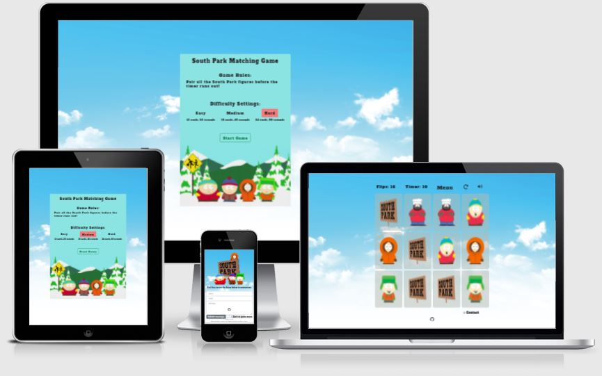
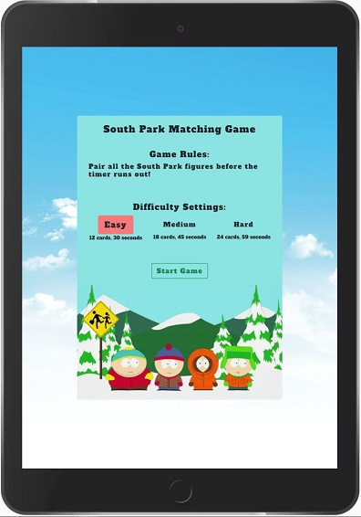
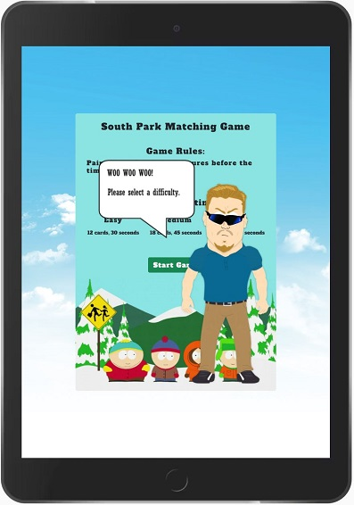
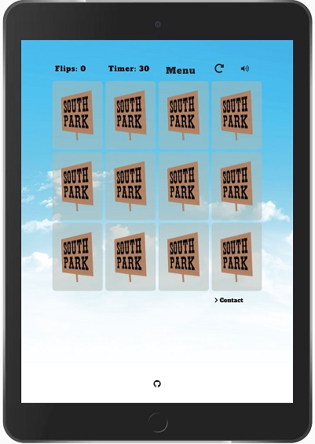
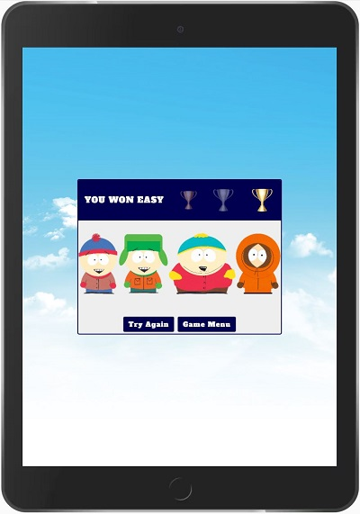
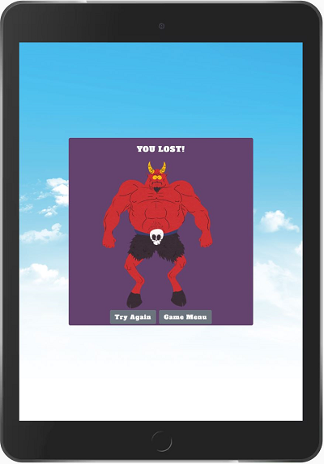
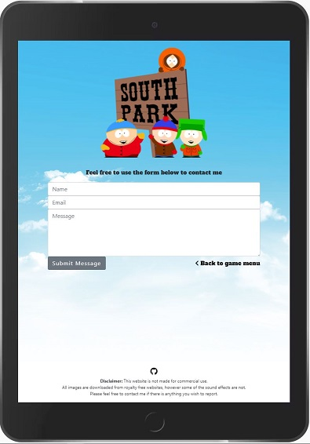
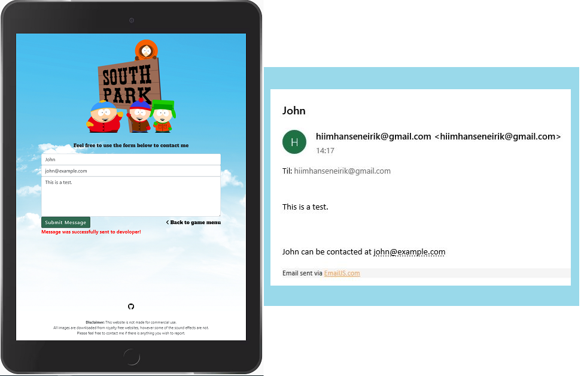

# South Park Memory Game

### South Park Memory Game is a fun and intuitive card game for all ages. In this game the goal is to find all the pairs in the card deck, displaying the most popular South Park characters. South Park is originally an american TV show that had its debut in 1997, and is still going strong. The show contains profanity, surreal humor and satire, making it less appropriate for the youngest. With that in mind I have not included any of this in this game, making it more user friendly for the youngest users. 
To visit the deployed website, click [here](https://hiimus.github.io/south-park-game/)
# Table of Contents

 * ### UX 
    * Project Goals
    * User Journey
    * User Stories
    * Wireframes
    * Features
    * Existing Features
    * Features Left to Implement
* ### Technologies Used
    * Tools
    * Libraries
    * Languages
* ### Testing
* ### Deployment
* ### Running the Project Locally
* ### Credits
    * Contents
    * Media
    * Acknowledgements
    

# UX
## Project Goals
 The main goal of this project is to let the user have fun and exercise their short term memory. For some users, South Park might be something they've never heard of. In that case, it might be a cool discovery of this little world. For other users it might not be new at all, but something that brings back good memories. Regardless, this games' sound effects and design will hopefully create a laugh or two. And with three different difficulty levels, it should be challenging even to the more skilled users.
## User Journey

The first thing the user will see when the page is loaded, is the menu modal. From here, the user has to select a difficulty in order to move on and let modal hide. If the user clicks the start game button before selecting a difficulty, PC Principal will pop up and tell the user what to do.

 

When the difficulty is selected, the game board will display. Here the easy difficulty has been selected.

If the user matched all the pairs before the timer runs out, the winning modal will show. If the user fails to do this, the losing modal will show. After winning or losing, the user can then choose "Try Again" or "Game Menu".

 

Let's say the user has found all the pairs, and the user clicked "Try Again" on the winning modal. Then the user will be directed back to the game board. From here the user can click on the contact button below the game board. The user will then be directed to the contact page. Here the user can write the developer a message. After the user has written a message, the user can either click on the logo or the "Back to game menu" button, which will direct the user to the modal menu.

## User Stories
The users of this site will be people of all ages, mostly younger users and young adults. User stories are made for young users, and young adults.
- As a young user/young adult, I want to get a quick understanding of what this game is about so that I can see if this is something I want to spend my time on.
- As a young user/young adult, I want the game to be intuitive, easy to play and navigate, so that I don't have to spend extra time on figuring out how things work.
- As a young user/young adult, I want to have the opportunity to change the difficulty, so that I can adjust it according to my preferences.
- As a young user/young adult, I want to have volume controls, so that I can adjust the volume according to my preferences.
- As a young user/young adult, I want the game to work smoothly and fast, so that I don't have to wait because of a delay.
- As a young user/young adult, I want to be able to replay the level, so that I can improve my score.
- As a young adult, I want to be able to contact the owners of the site, so that I can communicate with the owners.
- As a young adult, I want the game to have multiple levels, so that I can challenge myself.
## Wireframes
To make [wireframes](/wireframes), I used [Balsamiq](https://balsamiq.com/).
# Features
## Existing Features:
### index.html:
The index.html page is where the game board and game cards are. When loading the page, the first thing the user will see is a modal, and a background image. The background behind the modal is a sky that is used throughout the game. The thought was that South Park is set in Colorado, often with snow and blue sky, and also that it gives a good contrast from the colors and images I have used.

**The menu modal** is displaying the name of the game, with an image, game rules and the difficulty settings. The image is added to the modal footer, and the color of this sky has been added to the rest of the modal. Making it look like all the text is in the same image. The snow in the modal image does not have the best contrast against the sky background, but in my opinion it looks fine. The text in the modal is colored black, so it has a good contrast to the background color. The font used throughout the game is called Alfa Slab One. The reason I have chosen this font is because it resembles the font used in the actual South Park board/sign. For improved readability, I have added 1.5px letter-spacing. In the middle of the modal, there is a start game button. The user may be tempted to just click it straight away, in that case, a South Park figure called PC Principal will pop up and tell the user to select a difficulty first,  using both a speaking bubble and audio as a tool. When selecting a difficulty, the button will be marked with a red background and make a click sound effect. The user is then free to start the game, and when the start game button is clicked, the modal will be hidden and a South Park transition sound effect will play.

Once the modal is hidden, **the game board** with game cards will appear, together with five features above the game board. From left to right, the first feature is a flip counter, that will count all the flips each round. The second is a timer that starts each round, counting down from either 30, 45 or 59 seconds, depending on the difficulty being played. As it states in the rules: "Pair all the South Park figures before the timer runs out", the timer is what really matters in this game. If the user pairs all the figures, the user will be given a bronze, silver or gold trophy depending on how many seconds are left from the timer. I'll talk more about the trophies later. Third is a menu button, which simply returns the user back to the menu modal, mentioned earlier. Fourth is an intuitive restart wheel that rotates on mouseover, click and mouseleave. Of course all cards will be reset when clicking this button. Lastly, the fifth feature above the game board is the volume control. This will either keep the sound on or off. Mute or unmute. 

**The game board** consists of either 12, 18 or 24 cards, depending on the difficulty being played. This is also mentioned in the menu, before selecting a difficulty. The game board retains the same width and height, no matter the amount of cards, only the cards itself changes its width and height. I think that works good, but maybe the medium mode makes the cards look a bit high, especially on the South Park signs, before flipping. The game card background is a transparent color, giving the signs more attention, which is what I wanted. The transparent background is there to display the borders and alignment of the cards. When clicking a card, or sign, a South Park figure will appear behind it when it rotates. I have tried to use images of the most common figures, and as the difficulty increases, the figures become less common. 

There are **sound effects** being played on many different occasions in this game. If a player clicks a card, a click sound is played. If a player clicks another card, and that card matches the first one, a South Park figure (Sergeant Harrison Yates) will say "nice". If it doesn't match, a wrong sound will play. Also, when there is only five seconds left of the timer, a sort of bell will play each of the last five seconds. If the user wins the game, a figure called Mr. Hankey will say "Hoowdy ho". On the other hand, if the timer runs out, the user will lose the game, and a sort of evil dungeon sound will play.

There are two different modals that will display, depending if the user wins or loses the game. **The winning modal** contains a header with the text "You won <difficulty>" and three trophies. If the user has 10+ seconds left, no matter the difficulty setting, a gold trophy is displayed with a pulsing animation. The other trophies, silver and bronze will then be transparent and will not have the pulsing effect. If the user has 6-10 seconds left, the same thing will happen, only with the silver trophy. Lastly, if the user has 0-5 seconds left of the timer, the bronze trophy will have the pulsing effect, while the other trophies will not, and be transparent. This effect will give a clear indication of what the user has achieved. The body of the winning modal consist of an image of the most popular South Park figures; Stan, Kyle, Eric and Kenny. In the modal footer there are two buttons, that decides where the user will move on to next. The user can either click "Try Again", and that will have the same effect as clicking the restart wheel. Or, the user can click on "Game menu", which directs the user to the menu modal. The color used in the header, border and on the buttons, is just a dark blue color that had a nice contrast against the trophies. When hovering the buttons, dark green color is displayed. This color, found with the color picker tool in google devtools, is used in the buttons of the winning and losing modal. The color is also used in the contact page. More on the contact page later.

If the timer runs out before the user has managed to find all the pairs, the **losing modal** will appear. This modal consists of a header, with a white text saying "You lost!". In the losing modal body there is an image of a South Park figure called Satan, the ruler of hell. Together with the losing sound effect, this gives a good indication that the user has lost the game. Further, in the footer the buttons are the same as in the winning modal, regarding style, content and where they direct the user on click.

Below the game board there are two things to mention: A "Contact" link just below the game board, and a **Github link** in the footer. The Github link will direct the user to the repository of this project. **The contact link** will direct the user to the contact.html page.
### contact.html
This page is where the user can contact the developer for whatever reason. The page consists of an image , a form, a "Back to game menu" button, a Github link and a disclaimer message in the footer. 

In my opinion the image represents the game well, displaying the most popular figures from the show and the sign/board, which is heavily used as the backside of the cards. This image has an anchor link, so clicking it will direct the user back to the index.html page.

**The form** has three input fields where the user can insert their name, email address and message. The user can then Click on the submit button, and a red text will appear once the message has been sent. The form is linked up with the service emailJS. 

Below the form, there is a **"Back to game menu"** button, which directs the user to the menu modal.

In the footer there is a Github link here as well, and a **disclaimer message**. This disclaimer message is important for me because it explains that some of the sound effects are not downloaded from royalty free websites. And also that this website is not intended for commercial use. I really tried to get all my audio from royalty free websites, but I could not find any South Park sounds that were free. I tried to contact the website I got most of my South Park sound effects from, but without any reply. Since I think this game would not be the same without these sound effects, I decided to use them, and to have this disclaimer message in the contact page.

## Features Left to Implement:
This project has been really fun to make. I found myself wanting to add more and more stuff, here are some of the stuff I thought would be nice to implement.
1. In the menu modal, PC Principal will pop up if you don't select a difficulty before clicking start game. It would be fun if his head popped up from the sides of the modal, observing you/peeking at you, before even making a decision.
2. There really is not a way to pause the game while playing. So a pause button would be nice.
3. Volume control. I have a button that mutes/unmutes the sound, but it would be even better if the user was able to adjust the volume as well.
4. Improve the look of the game on mobile/smartphone devices. It does not look perfect on a smartphone. Maybe organizing the cards with one more row on the bottom so it gets higher and narrower. The images are very small in general, and the medium difficulty makes the images squished.
5. Score board. It would be nice if the user could see their previous scores, with times, flips and more. That would maybe give the user motivation to play more and beat their score.
6. I should have had more JavaScript files instead of just two. My main js file has a lot of code which could have been spread out to several files, making it easier to read, work on and understand.
# Technologies Used
## Tools:
- [Gitpod](https://www.gitpod.io/) used as an IDE.
- [GitHub](https://github.com/) used to store and share repositories.
- [Git](https://git-scm.com/) for version control.
- [Balsamiq](https://balsamiq.com/) for creating wireframes.
- [Google Chrome DevTools](https://developer.chrome.com/docs/devtools/) to view the site in various screen sizes and devices. For trying out style and code without doing any real changes to the page. 
- [Responsive Design Checker](https://www.responsivedesignchecker.com/) for testing responsiveness on various screen sizes and devices.
- [Microsoft Paint](https://support.microsoft.com/en-us/windows/get-microsoft-paint-a6b9578c-ed1c-5b09-0699-4ed8115f9aa9) was used paint to make the speaking bubble that appears when not selecting difficulty.
- [Am I Responsive](http://ami.responsivedesign.is/), a tool that views the site on various devices.
- [Audio Trimmer](https://audiotrimmer.com/#), was used to trim down the audio used in the last five seconds of the game. 
- [Cloud Convert](https://cloudconvert.com/), was used to convert wav files to mp3 files.
- [Online PNG Tools](https://onlinepngtools.com/) was used to compress and reduce PNG files without losing transparency.
- [EmailJS](https://www.emailjs.com/), was used as an email service for the contact.html page.
- [YouTube](https://www.youtube.com/), was used to help me understand JavaScript, and how to make certain parts of the game.
## Libraries:
- [Bootstrap](https://getbootstrap.com/docs/5.0/getting-started/introduction/) for a quick page structure and components.
- [Google Fonts](https://fonts.google.com/) as a provider of font styles for my project.
- [Font Awesome](https://fontawesome.com/) as a provider of icons.
- [Jquery](https://jquery.com/) as a tool to with write easier and also less code.

Languages:

[HTML5](https://en.wikipedia.org/wiki/HTML5),  [CSS3](https://en.wikipedia.org/wiki/CSS) and [JavaScript](https://developer.mozilla.org/en-US/docs/Web/JavaScript).
# Testing
The testing of this project can be found as a separate [TESTING.md](TESTING.md) file.
# Deployment
My project was deployed to GitHub pages. 
1. Go to [GitHub](https://github.com/) and sign in to account.
2. Click on your profile menu in the top right corner, then "your repositories".
3. Click on "south-park-game" and then click on "settings".
4. Once on this page, scroll down to the "GitHub Pages" section, and select "main-branch". Click save.
5. The page will refresh, and after a short while, scroll down again to the same "GitHub Pages" section. There you will have a green section displaying "Your site is published at ...". The site is now deployed. 
See [GitHub Pages documentation](https://docs.github.com/en/pages).
## Running the Project Locally
Cloning this project from GitHub:

1. Click on "south-park-game" in GitHub and then click on the dropdown box that says "Code".
2. Once clicked, you can see the HTTPS URL. Copy this link.
3. Open your IDE, and open the command line.
4. Type git clone, and past the URL you copied from GitHub.
5. Press enter, and the clone will be created in a folder of the IDE you have open.
# Credits
## Content
This project has been a real challenge for me. In the beginning, I had no idea how to start regarding JavaScript. I knew there were tons of resources I could use on the internet, so I started with youtube. On youtube I found a really helpful [video](https://www.youtube.com/watch?v=ZniVgo8U7ek) made by [Marina Ferreira](https://github.com/code-sketch/memory-game/). I used the code in this tutorial, and then modified it to suit my project. Big thanks to Marina Ferreira for giving me a good starting point. I have tried to comment out where I have used the code from the video, but after I have modified and refactored this code it is spread out into different functions. I can at least mention that this video tutorial helped me to organise the cards and gameboard, write code that gives the cards a flip effect, and check if the cards match or not. It also helped me lock the board so you can't click on more than two cards at a time.

Big thanks to the [Code Institute](https://codeinstitute.net/) videos (Sending Emails Using EmailJS), for teaching me how to implement the emailJS service to my contact.html page. I also used the source code from these videos so that I could make a similar form, only with a couple of changes. 

Learning about audio and volume control is credited to [this](https://www.developphp.com/video/JavaScript/Audio-Play-Pause-Mute-Buttons-Tutorial) website. 

## Media
All the images used in this project were downloaded from [PNG Egg](https://www.pngegg.com/). 

Audio is downloaded from [Voicy](https://www.voicy.network/), [Myinstants](https://www.myinstants.com/) and [Open Game Art](https://opengameart.org/).

## Acknowledgements
My mentor [Precious Ijege](https://www.linkedin.com/in/precious-ijege-908a00168/) for guiding, supporting and pointing me in the right direction.

The Code Institute [Slack](https://slack.com/) channel for having discussion, questions and answers that contribute to my project. Also a lot of similar projects are posted in the slack channel, which contributed to the planning of my project. 

[Stack Overflow](https://stackoverflow.com/) for helping me understand and solving issues along the way.

