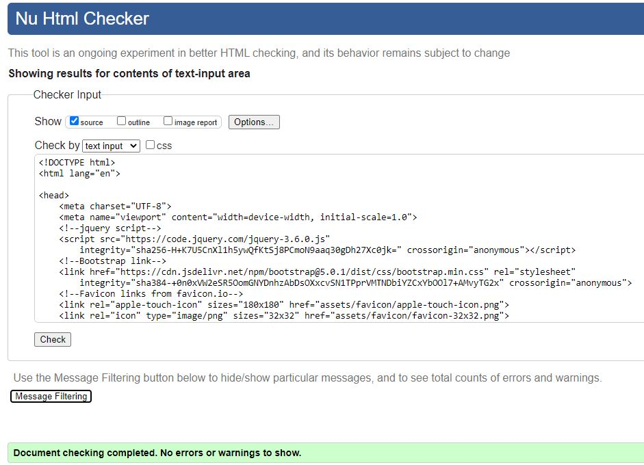
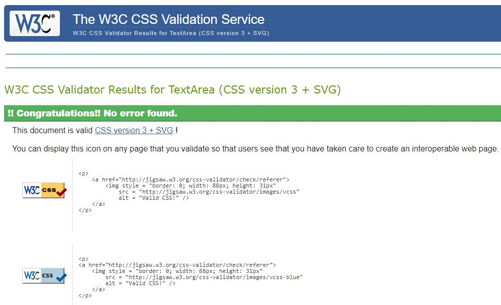
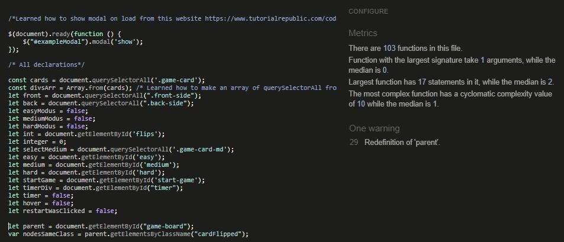
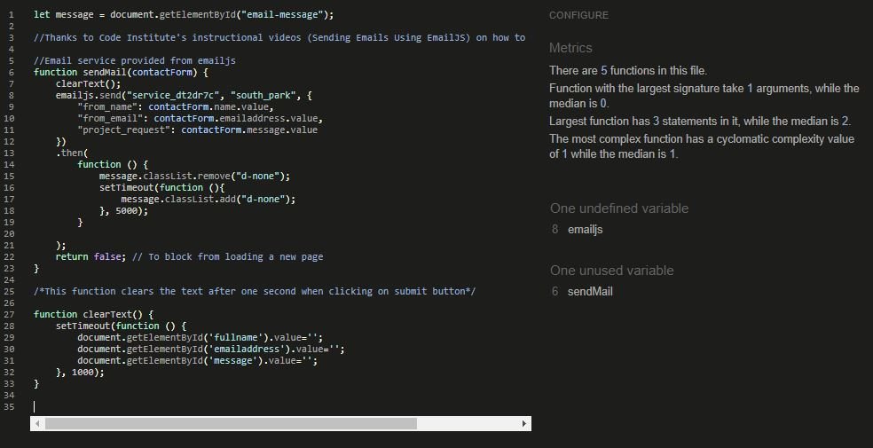
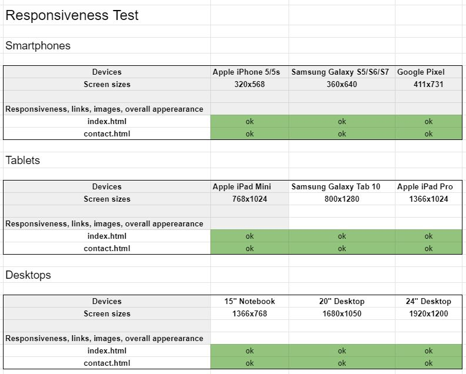
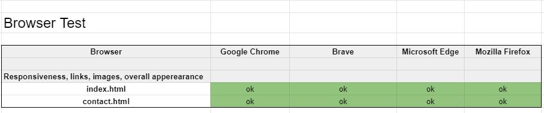

# Testing
## Code Validators
[W3C HTML Validator by Direct input](https://validator.w3.org/) 

- index.html results: No errors or warnings to show.

- contact.html results: No errors or warnings to show.

[W3C CSS Validator via Direct Entry](https://jigsaw.w3.org/css-validator/#validate_by_input)

- style.css results: No errors found.

[JSHint Linter test](https://jshint.com/)

- index.html results: No major issues, only one warning that I tried fix but with no luck.

- contact.html results: No major issues, only "one undefined variable" and "one unused variable", that I really can't remove because then the emailJS service won't work.

## Responsiveness

Tools that were used to check for responsiveness were [Responsive Design Checker](https://responsivedesignchecker.com/) and [Chrome DevTools.](https://developer.chrome.com/docs/devtools/)

## Browser Testing

## User Story Testing

The users of this site will be people of all ages, mostly younger users and young adults. User stories are made for young users, and young adults.
- As a young user/young adult, I want to get a quick understanding of what this game is about so that I can see if this is something I want to spend my time on.

Results: The first thing the user will see is the menu modal. Here there is an image of South Park figures and a header explaining what type of game it is. 
- As a young user/young adult, I want the game to be intuitive, easy to play and navigate, so that I don't have to spend extra time on figuring out how things work.

Results: The game is made to be intuitive and easy to play. The game rules are nice and short, and if you do not select difficulty first, a pop-up will tell you what to do. Once on the game board, the user will see cards displaying the back side, ready to be flipped. Above the game board there is a menu and some icons that is self-explaining. A link to the contact page is present both in the game menu and below the game board.

- As a young user/young adult, I want to have the opportunity to change the difficulty, so that I can adjust it according to my preferences.

Results: This game has three difficulties. Easy, medium and hard. These can be selected upon loading the page, or by clicking on the menu button. Winning the game can give the user a trophy, depending on how fast the user finds all the pairs. This adds an extra challenge if the user wants to get the gold trophy.

- As a young user/young adult, I want to have volume controls, so that I can adjust the volume according to my preferences.

Results: Once the user is in the game environment, an icon above the game board will provide this. The user can either have the sound effects on or off.

- As a young user/young adult, I want the game to work smooth and fast, so that I don't have to wait because of delay.

Results: The game is made so that the user does not have to wait a very long time before the cards turn again if they don't match. I tried to have a nice balance between having a fast pace, and having enough time to remember the cards. 

- As a young user/young adult, I want to be able to replay the level, so that I can improve my score.

Results: When the user either wins or loses, the user has the option to click on the button "Try Again".

- As a young adult, I want to be able to contact the owners of the site, so that I can communicate with the owners.

Results: The user has the option to click on the "Contact" button that is visible in the menu, and on the game board. Once clicked, the user will be directed to the contact site, were the user can write a message to the developer that made the site.

- As a young adult, I want the game to have multiple levels, so that I can challenge myself.

Results: Results: This game has three difficulties. Easy, medium and hard. These can be selected upon loading the page, or by clicking on the menu button. Winning the game can give the user a trophy, depending on how fast the user finds all the pairs. This adds an extra challenge if the user wants to get the gold trophy. Winning the gold trophy on hard difficulty is extra challenging.

## Bugs

Developing this game was not without it's bugs. Some of them were easy to fix, other took some time to figure out. Here are some of them:

1. Favicons. At first, I got an error in the console which I didn't understand. After googling it, I understood what it was, and fixing it actually made my site look better. I used the tool from [Favicon](https://favicon.io/) to make a favicon. I did what the site said, and everything worked fine. A couple of days later, I get a 401 error message about the site.webmanifest file. I did not know what to do, and it seemed no one else had the same problem as me, like it was such a no-brainer. Luckily, I stumbled upon this [article](https://medium.com/@aurelien.delogu/401-error-on-a-webmanifest-file-cb9e3678b9f3
) from [medium.com](https://medium.com/), which explained an easy fix. I simply added crossorigin="use-credentials" in my link, and this solved my problem, and I got no more errors from it.

2. Using other people's code. I am really grateful for the [video tutorial](https://www.youtube.com/watch?v=ZniVgo8U7ek) made by [Marina Ferreira](https://github.com/code-sketch/memory-game/), that turned out to be the backbone of my game. However, this caused me lots of frustration because I did not create it myself. So when I was adding and modifying on that code, it didn't always make sence for me. This lesson has taught me to be careful when using other people's code, and try to solve it with your own code first.

3. Re-sizing images and losing transparancy. This game has alot of images, and so I tried to compress all the images. I have done this in paint before, and when I did it, the transparent background was lost. This means that all images suddenly got a white background, which did not look good. Through this [link](https://stackoverflow.com/questions/13964076/reduce-size-of-a-png-image-without-losing-transparency) from [Stack Overflow](https://stackoverflow.com/) I found out about the tool [Online PNG Tool](https://onlinepngtools.com/resize-png) that both compressed, and retained the transparent background.

